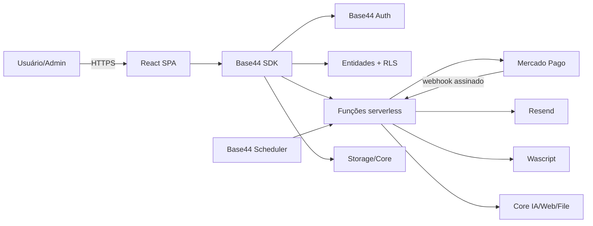
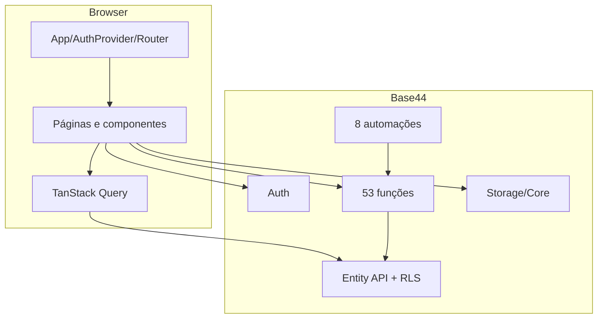
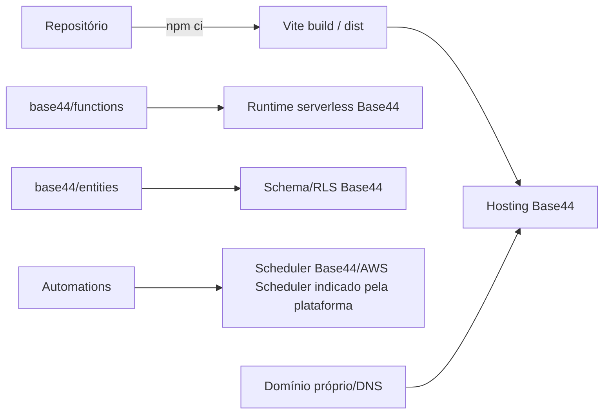
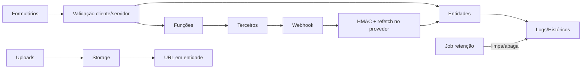

# 01 — Arquitetura atual

## Visão real
- **Frontend (CONFIRMADO):** SPA React/Vite; `src/main.jsx` → `src/App.jsx`; layouts `AppLayout`/`CustosLayout`; estado local React e cache TanStack Query.
- **Backend (CONFIRMADO):** Base44 BaaS + funções HTTP Deno em `base44/functions/*/entry.ts`; módulos comuns em `base44/shared/*`.
- **Dados (CONFIRMADO):** entidades Base44 e RLS declarativa. Tecnologia física do banco: **NÃO ENCONTRADO**.
- **Auth (CONFIRMADO):** Base44 Auth, senha, OTP e Google OAuth; token no cliente; User embutido.
- **Storage (CONFIRMADO):** Core UploadFile/UploadPrivateFile e URLs persistidas.
- **Assíncrono (CONFIRMADO):** automações Base44 scheduled/entity; webhooks Mercado Pago.

## Contexto

## Componentes

## Deployment atual

`AWS Scheduler` é **CONFIRMADO** apenas pelos ARNs retornados pelo inventário; detalhes de conta/região são gerenciados pela plataforma.

## Fluxo de dados

## Estado
- Stateful: entidades/User, storage, sessões/tokens, configurações, automações, cache Query, formulários e `sessionStorage` de fluxos auth/evento.
- Stateless: componentes de apresentação, calculadoras puras em `src/lib`, handlers HTTP entre chamadas (exceto persistência externa).

## Base44 a substituir
Auth, Entity API/RLS, SDK, funções/runtime, scheduler, storage/Core, integrações IA/e-mail/arquivo, analytics, hosting e publicação.

Fontes: `src/App.jsx`, `src/lib/AuthContext.jsx`, `src/api/base44Client.js`, `vite.config.js`, `base44/*`.