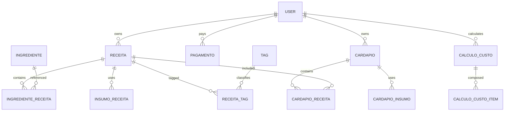

# 06 — Banco de dados

## Plataforma
- **CONFIRMADO:** Base44 Entities, schemas JSON e RLS em `base44/entities/*.jsonc`.
- **CONFIRMADO:** campos embutidos `id`, `created_date`, `updated_date`, `created_by_id`.
- **NÃO ENCONTRADO:** engine/versão, DDL físico, schema, índices, FKs, sequences, views, procedures, triggers e migrations internas.
- `migration/schema.sql` é **INFERIDO/PORTABILIDADE**, não dump DDL do Base44.

## Entidades por domínio
- Núcleo: `User`, `Receita`, `Ingrediente`, `IngredienteReceita`, `IngredienteUsuario`, `MedidaCaseira`, `Insumo`, `InsumoReceita`, `IngredienteEsquecidoReceita`, `ReceitaTag`, `Tag`, `SinonimosIngredientes`.
- Cardápio/evento: `Cardapio`, `CardapioReceita`, `CardapioInsumo`, `CardapioTag`, `Planejamento`, `ReferenciaEvento`, `ListaCompras`, `CarrinhoItem`, `UtensilioPadrao`.
- Custos: `CalculoCusto`, `CalculoCustoItem`, `ConfiguracaoCustosUsuario`, `DespesaCustoUsuario`, `AcessoLaboratorioCustosUsuario`, `ConfiguracaoAddonCustos`, `CuradoriaCusto*`, `NormalizacaoCustoReceitaLog`.
- Comercial/comunicação: `Pagamento`, `ConfiguracaoPlano`, `TemplateEmail`, `TemplateWascript`, `TemplateWhatsApp`, `ConfiguracaoEmail`, `LogEmail`, `LogWhatsapp`, `LogWebhookMercadoPago`.
- Conteúdo/config: `DicaCarmen`, `ConfiguracaoCarmen`, `ConfiguracaoSistema`, `AppConfig`.
- Auditoria/manutenção: entidades `Log`, `Relatorio`, `Probe`, `Saneamento`, `Curadoria`, `Normalizacao`, `Correcao` listadas nos arquivos de entidade.

## Relações lógicas principais

Relações são IDs string sem FK física confirmada.

## RLS confirmada
- Catálogo (`is_base=true`) legível; cópias por `usuario_dono_id`; admin global.
- Filhos espelham `is_base`/dono.
- Pagamento: dono lê, admin escreve.
- Configs/templates/logs administrativos: admin.
- AppConfig: `created_by_id`.
- User: plataforma restringe gestão; campos comerciais/admin têm field-level write/read.

## Dicionário
Os arquivos JSONC são a fonte canônica de colunas, tipo, enum, default, required e RLS. Para cada tabela, converter `properties` para colunas; arrays/objetos para JSONB; `required`→NOT NULL quando não conflitar com registros legados; relações acima precisam de FKs `NOT VALID` e validação posterior.

## Seeds
**NÃO ENCONTRADO:** seed formal. Configurações e catálogo parecem dados de produção. Exportar separadamente; não promover dados pessoais a seed.