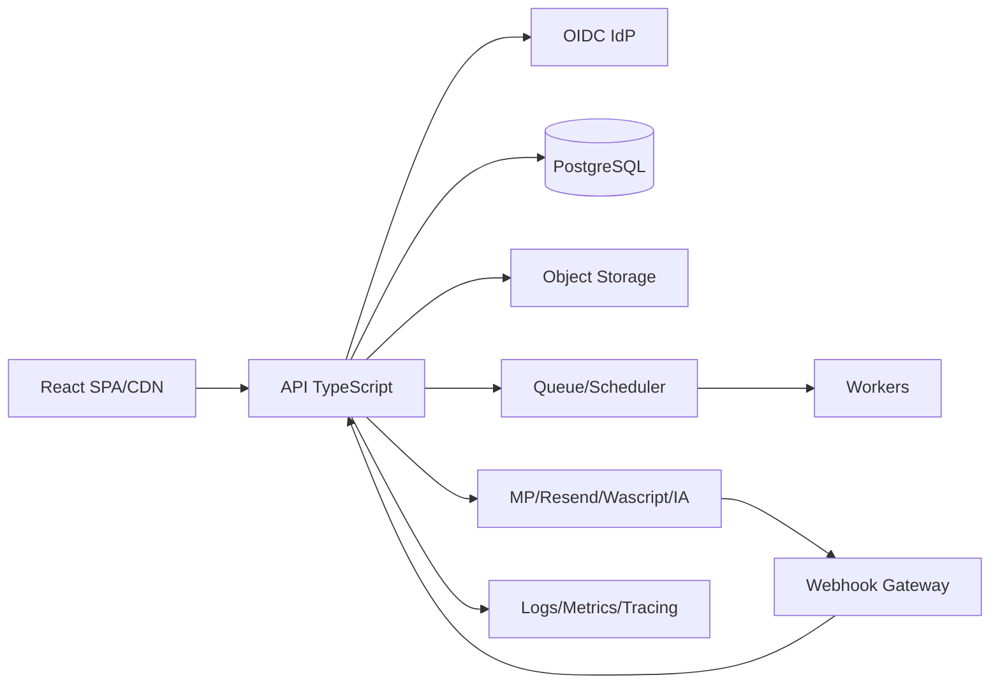

# 17 — Arquitetura destino independente

## Requisitos extraídos
SPA responsiva; API autenticada; banco relacional/JSON; isolamento multiusuário; object storage público/privado; jobs; webhooks públicos assinados; e-mail/WhatsApp/IA; PDFs; observabilidade; deploy reversível.

| Componente atual | Função | Dependência | Requisito substituto | Alternativas |
|---|---|---:|---|---|
| Base44 Hosting | SPA/CDN/TLS | sim | assets, SPA fallback, domínio | CDN+object storage; PaaS frontend |
| Auth/User | identidade | sim | senha/OTP/OAuth/reset/sessão | IdP gerenciado; auth self-hosted |
| Entities/RLS | dados/autorização | sim | transações, policies, IDs | PostgreSQL+API; BaaS alternativo |
| Functions | API/jobs | sim | runtime TS, secrets, HTTP | containers; serverless |
| Storage/Core | objetos/IA | sim | ACL/signed URL/LLM | S3 compatível + provedor IA |
| Automations | agenda | sim | timezone/retry/lock | scheduler+queue; cron PaaS |
| Analytics/logs | telemetria | sim | logs/métricas/alertas | OpenTelemetry + stack gerenciada |

## Opções
### A — PaaS gerenciado modular
React CDN + API TypeScript + PostgreSQL gerenciado + object storage + scheduler/queue + IdP. **SUGESTÃO inicial**: menor risco operacional e lock-in moderado.
### B — BaaS alternativo
Mais rápido, mas risco de repetir lock-in/RLS/auth não equivalentes.
### C — Kubernetes/self-hosted
Maior controle/portabilidade, custo e operação altos; só se requisitos corporativos justificarem.

## Arquitetura lógica recomendada (não decisão final)

## Critério de escolha
PoC dos contratos críticos, custo 3 anos, RPO/RTO, LGPD/região, exportabilidade, skills e carga estimada. **AÇÃO NECESSÁRIA:** obter volumes/SLA/orçamento antes de selecionar fornecedores.