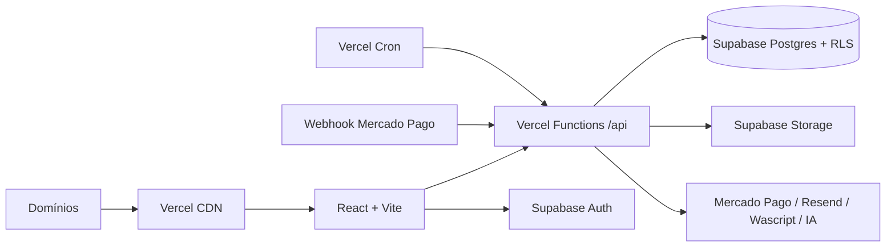

# 37 — Guia de migração e implantação na Vercel

> Guia operacional para levar o frontend Vite e as funções HTTP do Laboratório de Cozinha à Vercel, usando Supabase como destino de autenticação, banco e arquivos. Este documento não executa a migração; define o caminho, os contratos e os critérios de aceite.

## 1. Escopo e estado atual

A aplicação atual é uma SPA React/Vite, roda em Node 20 no processo de build e usa:

- `@base44/vite-plugin` durante desenvolvimento/build;
- `@base44/sdk` no frontend e nas funções;
- entidades, autenticação, RLS, arquivos, integrações e automações Base44;
- funções TypeScript/Deno em `base44/functions/` e módulos comuns em `base44/shared/`;
- domínio público `https://laboratoriodecozinha.com.br`;
- aplicação autenticada em `https://app.laboratoriodecozinha.com.br`;
- endpoint Base44 legado `https://laborat-rio-de-cozinha.base44.app` durante a transição.

A migração só termina quando o bundle, as chamadas de rede e a operação em staging não dependerem de hosts, SDK, runtime ou credenciais Base44.

## 2. Arquitetura recomendada



### Decisão inicial

Usar **um projeto Vercel** com os dois domínios durante a migração preserva a SPA e a lógica atual baseada em hostname. O mesmo artefato atende o site público e o subdomínio autenticado. Separar em dois projetos só deve ocorrer depois, caso seja necessário isolar releases, equipes, métricas ou políticas de cache.

### Responsabilidades

| Camada | Destino | Responsabilidade |
|---|---|---|
| Frontend | Vercel CDN | SPA, assets e navegação cliente |
| API curta | Vercel Functions Node.js | autenticação, validação, transações e integrações |
| API Edge | Vercel Edge, somente quando elegível | operações leves, sem bibliotecas Node e sem processamento longo |
| Dados | Supabase Postgres | tabelas, constraints, transações e RLS |
| Identidade | Supabase Auth | senha, OTP, OAuth, reset e sessão |
| Arquivos | Supabase Storage | objetos públicos/privados e URLs assinadas |
| Agenda | Vercel Cron + função idempotente | gatilhos de horário em UTC |
| Tarefas pesadas | worker/fila dedicada | lotes longos, retries e processamento assíncrono |

## 3. Configuração do projeto Vercel

### 3.1 Build

| Configuração | Valor inicial |
|---|---|
| Framework Preset | Vite |
| Node.js | 20.x |
| Install Command | `npm ci` |
| Build Command | `npm run build` |
| Output Directory | `dist` |
| Root Directory | raiz do repositório |

Antes de cada release, executar:

```bash
npm run typecheck
npm run lint
npm run build
npm run test:build-budget
```

O build atual ainda requer o plugin Base44. A remoção deve ocorrer apenas depois que imports do SDK, parâmetros de bootstrap e analytics Base44 forem substituídos. O `vite.config.js` de destino deve manter apenas plugins Vite realmente necessários, começando por React.

### 3.2 SPA fallback

Criar `vercel.json` no momento da implantação, com:

- fallback de rotas do React Router para `/index.html`;
- preservação de arquivos estáticos e rotas `/api/*`;
- redirecionamento permanente de `www` para o domínio público canônico;
- cabeçalhos de segurança definidos e testados, sem bloquear Mercado Pago, fontes, imagens ou chamadas Supabase.

Exemplo conceitual — validar em Preview antes de promover:

```json
{
  "rewrites": [
    { "source": "/((?!api/).*)", "destination": "/index.html" }
  ],
  "redirects": [
    {
      "source": "/:path*",
      "has": [{ "type": "host", "value": "www.laboratoriodecozinha.com.br" }],
      "destination": "https://laboratoriodecozinha.com.br/:path*",
      "permanent": true
    }
  ]
}
```

A expressão de fallback deve ser confirmada contra a versão ativa do roteador da Vercel. O teste obrigatório é abrir diretamente cada deep link e confirmar que `/api/*` continua chegando às funções, nunca ao HTML da SPA.

## 4. Domínios e redirects

### 4.1 Domínios no projeto

Adicionar no painel da Vercel:

1. `laboratoriodecozinha.com.br` — site institucional canônico;
2. `www.laboratoriodecozinha.com.br` — alias com redirect permanente para o domínio sem `www`;
3. `app.laboratoriodecozinha.com.br` — aplicação autenticada.

Aplicar no provedor DNS exatamente os registros exibidos pela Vercel; não fixar valores de A/CNAME em documentação porque podem variar por conta e configuração. Só reduzir TTL e trocar DNS após Preview, APIs, OAuth, webhooks e rollback estarem homologados.

### 4.2 Matriz de roteamento

| Origem | Caminho | Resultado esperado |
|---|---|---|
| domínio público | `/`, `/termos`, `/privacidade`, `/sobre`, `/contato`, `/produto` | permanece no site público |
| domínio público | rota autenticada, como `/receitas` | redirect para `app.` preservando caminho, query e hash |
| `app.` | `/login`, `/register`, `/forgot-password`, `/reset-password` | fluxo de autenticação |
| `app.` | `/app` e demais rotas protegidas | SPA autenticada |
| `www` | qualquer rota | 308 para domínio público sem `www` |
| host Base44 legado | links antigos | manter durante coexistência; retirar somente após expiração/redirect dos links |

Preservar a validação de `returnTo` como caminho interno. Nunca aceitar URL absoluta, `//host`, barra invertida ou origem externa.

### 4.3 URLs externas a recadastrar

- callback e origens autorizadas do Supabase Auth;
- Google OAuth e demais provedores;
- URL de reset de senha;
- webhook Mercado Pago: destino futuro `https://app.laboratoriodecozinha.com.br/api/webhooks/mercadopago` (ou host de API aprovado);
- links transacionais de Resend/Wascript;
- CSP/CORS e allowlists dos provedores.

Durante homologação, não trocar o webhook de produção diretamente: usar endpoint de staging ou notificação paralela quando o provedor permitir.

## 5. Variáveis de ambiente

Na Vercel, cadastrar valores separados para **Development**, **Preview** e **Production**. Variáveis com prefixo `VITE_` entram no bundle e são públicas; nunca colocar segredos nelas.

### 5.1 Frontend público

| Variável proposta | Finalidade |
|---|---|
| `VITE_PUBLIC_SITE_URL` | `https://laboratoriodecozinha.com.br` |
| `VITE_APP_SITE_URL` | `https://app.laboratoriodecozinha.com.br` |
| `VITE_API_BASE_URL` | `/api` no mesmo projeto ou URL da API |
| `VITE_SUPABASE_URL` | URL pública do projeto Supabase |
| `VITE_SUPABASE_ANON_KEY` | chave pública/anon; a proteção real permanece na RLS |
| `VITE_ENVIRONMENT` | `development`, `preview` ou `production` |

Substituir os valores fixos de domínio em `publicUrls.js` por essas variáveis somente na fase de implementação. Preview deve usar URLs próprias ou resolver a origem atual; nunca apontar Preview para dados de produção por conveniência.

### 5.2 Backend secreto

| Variável proposta | Sensibilidade | Consumidor |
|---|---:|---|
| `SUPABASE_URL` | não secreta | Functions |
| `SUPABASE_SERVICE_ROLE_KEY` | alta | somente backend privilegiado |
| `SUPABASE_JWT_SECRET` ou JWKS/config equivalente | alta/config | validação de sessão conforme arquitetura escolhida |
| `DATABASE_URL` | alta | somente se houver conexão SQL direta |
| `MERCADOPAGO_ACCESS_TOKEN_PROD` | alta | pagamentos/webhook |
| `MERCADOPAGO_ACCESS_TOKEN_SANDBOX` | alta | ambientes não produtivos |
| `MERCADOPAGO_WEBHOOK_SECRET` | alta | webhook |
| `AMBIENTE` | configuração | seleção segura de credenciais |
| `RESEND_API_KEY` | alta | e-mail |
| `WASCRIPT_API_TOKEN` | alta | WhatsApp |
| `WASCRIPT_MODO_TESTE` | configuração | bloqueio de envio real |
| `CRON_SECRET` | alta | autenticação dos jobs agendados |

Regras:

1. service role nunca chega ao browser;
2. Production e Preview usam projetos/credenciais separados;
3. segredos não são impressos em logs nem incluídos em respostas;
4. rotação ocorre após o cutover e após qualquer exposição suspeita;
5. nomes Base44 (`VITE_BASE44_*`, `BASE44_LEGACY_SDK_IMPORTS`) são eliminados ao final, não apenas renomeados.

## 6. Migração do frontend

Criar uma camada de acesso com contratos estáveis antes de trocar a implementação:

- `auth`: sessão, usuário atual, login, OTP, OAuth, reset e logout;
- `entities/repositories`: CRUD e consultas por domínio;
- `functions/api`: chamadas HTTP autenticadas;
- `storage`: upload, objeto privado e URL assinada;
- `analytics`: eventos sem dados pessoais.

Ordem segura:

1. congelar os contratos usados pelas telas;
2. implementar adaptadores Supabase/API em paralelo;
3. migrar um domínio funcional por vez;
4. rodar testes de equivalência e RLS;
5. remover `@base44/sdk` do frontend;
6. remover `@base44/vite-plugin` e variáveis Base44;
7. confirmar que não existem requests para hosts Base44.

## 7. Migração das funções backend

### 7.1 Estrutura destino sugerida

```text
api/
  functions/
    [name].ts
  webhooks/
    mercadopago.ts
  cron/
    trial-expirando.ts
    trial-vencido.ts
    plano-vencendo.ts
    lembrete-pagamento.ts
    atualizar-precos.ts
server/
  auth/
  repositories/
  services/
  shared/
```

A rota pública pode manter temporariamente o contrato `POST /api/functions/<nome>`, reduzindo mudanças no frontend. Módulos hoje em `base44/shared/` migram para `server/shared/` ou serviços específicos; lógica compartilhada não deve ser duplicada entre handlers.

### 7.2 Adaptações obrigatórias

| Base44 atual | Vercel/Supabase destino |
|---|---|
| `Deno.serve` / `export default function(Request)` | handler Vercel padronizado |
| `createClientFromRequest` | validar Bearer token Supabase e criar cliente no contexto |
| `base44.auth.me()` | `supabase.auth.getUser(token)` ou validação server-side equivalente |
| `asServiceRole.entities.*` | cliente Supabase service role no backend |
| `entities.X.*` | repositories com SQL/Supabase e transações |
| `secrets.get()` | `process.env.NOME_LITERAL` |
| integrações Core | SDK/API do provedor por serviço |
| `base44.functions.invoke` | `fetch` para `/api/functions/<nome>` |
| logs em entidades | tabelas de auditoria + logs estruturados Vercel |

Toda função autenticada deve distinguir:

- 401: sem sessão ou token inválido;
- 403: usuário válido sem permissão;
- 400/422: entrada inválida;
- 409: conflito/idempotência;
- 500: falha inesperada sem vazar segredo ou payload sensível.

### 7.3 Node.js Functions versus Edge

**Padrão recomendado para este projeto: Node.js Functions.** Usar Node para:

- pagamentos e webhook Mercado Pago;
- Resend e Wascript;
- operações com service role e transações;
- importações CSV, fusões, normalizações e saneamentos;
- geração/processamento de arquivos;
- tarefas administrativas ou em lote;
- módulos que usam APIs de Node, bibliotecas não compatíveis com Edge ou execução longa.

Edge só é candidato quando a função é curta, stateless, baseada em Web APIs, sem módulos Node, sem lote e sem necessidade de transação longa. Exemplos possíveis: health/config público ou validação leve. Não migrar para Edge apenas por latência; primeiro provar compatibilidade, região do Supabase e benefício mensurável.

### 7.4 Classificação do inventário atual

| Grupo | Funções | Destino inicial |
|---|---|---|
| Pagamento/webhook | `criarPagamentoMercadoPago`, `webhookMercadoPago`, `reprocessarPagamentoPix`, `reprocessarPagamentoEstorno`, `testarAssinaturaWebhookMP` | Node; webhook público assinado |
| Comunicação/agendadas | `campanhaEmail`, `enviarLembretePendencia`, `enviarPlanoVencendo`, `enviarTrialExpirando`, `enviarTrialVencido` | Node; cron/fila, idempotência |
| Custos e curadoria | normalizações, auditorias, invalidação, saneamento, preflights e `salvarCalculoCusto` | Node; dividir lotes grandes |
| Importação e manutenção | importadores CSV, fusão, padronização, correções e backfills | Node/worker; nunca Edge |
| IA/preços/tags | `buscarPrecosIA`, `aplicarTagsAutomatico`, análise de receita e atualização de preços | Node; timeout, quota e retry controlados |
| Consultas curtas | `contagensHome` e leituras equivalentes | Node inicialmente; Edge apenas após medição |
| Funções temporárias `f102-*`/`fase102-*` | executores e aliases históricos | auditar e aposentar; não migrar cegamente |

Antes de portar cada função, registrar: rota/método, autenticação, papel exigido, schema de entrada/saída, tabelas lidas/escritas, efeitos externos, idempotência, timeout, retry e teste de contrato.

### 7.5 Webhook Mercado Pago

O webhook é crítico e deve permanecer em Node na primeira versão. Preservar:

1. leitura de `data.id` em query/body;
2. validação HMAC de `x-signature` com `x-request-id`;
3. nova consulta à API do Mercado Pago, sem confiar no corpo recebido;
4. suporte separado a `order` e `payment`;
5. idempotência para todos os estados finais;
6. transação/consistência entre pagamento e assinatura;
7. logs mínimos, sem corpo bruto, token, assinatura ou dados financeiros desnecessários;
8. resposta rápida ao provedor; efeitos lentos devem ir para fila/outbox;
9. testes de replay, atraso, duplicidade, ordem invertida, PIX e estorno.

Não apontar o webhook produtivo para Vercel antes de publicar as variáveis de Production e concluir teste assinado no endpoint definitivo.

## 8. Cron, filas e tarefas longas

Vercel Cron chama endpoints HTTP em UTC. Recriar inicialmente:

| Job | Horário Base44 observado | Destino |
|---|---|---|
| Trial expirando | diário 08:00 UTC | `/api/cron/trial-expirando` |
| Trial vencido | diário 08:05 UTC | `/api/cron/trial-vencido` |
| Plano perto de vencer | diário 08:10 UTC observado | `/api/cron/plano-vencendo` |
| Pagamento pendente | diário 11:15 UTC | `/api/cron/lembrete-pagamento` |
| Atualização de preços | segunda 06:00 UTC e regra mensal a reconciliar | `/api/cron/atualizar-precos` |

A configuração da plataforma Base44 e alguns arquivos divergem; reconciliar a agenda efetiva antes do cutover. Cada endpoint de cron deve:

- exigir `CRON_SECRET`/mecanismo oficial;
- gerar `run_id`;
- adquirir lock singleton;
- ser idempotente;
- processar páginas/lotes com checkpoint;
- registrar início, fim, duração, contagens e erro;
- impedir envio real em Preview;
- possuir retry e estratégia de falha parcial.

Tarefas que excedam limites de duração, memória ou volume da Vercel devem ser movidas para worker/fila. Gatilhos por alteração de entidade não viram cron: implementar com trigger/outbox do Postgres, webhook de banco ou fila.

## 9. Ambientes e fluxo de deploy

| Ambiente | Vercel | Supabase | Provedores externos |
|---|---|---|---|
| Development | local | projeto local/dev | sandbox/mock |
| Preview | URL por branch | projeto staging | sandbox; envios bloqueados |
| Production | domínios canônicos | projeto produção | credenciais produção |

Fluxo:

1. pull request gera Preview;
2. migrations são aplicadas primeiro em staging;
3. smoke tests cobrem rotas, auth, RLS, APIs e integrações sem efeito real;
4. merge promove frontend/API;
5. migrations produtivas compatíveis são executadas;
6. flags habilitam módulos gradualmente;
7. logs, erros e latência são monitorados;
8. DNS/webhooks/jobs só mudam em janela de cutover.

## 10. Segurança

- RLS do Supabase é obrigatória para dados pessoais; service role contorna RLS e fica restrita a funções autorizadas.
- Handlers nunca aceitam `user_id`, papel ou proprietário do cliente como prova de autorização.
- CORS permite apenas origens aprovadas; chamadas same-origin são preferidas.
- Aplicar rate limit a login indireto, IA, importação, pagamento e endpoints públicos.
- Validar tamanho e tipo de uploads; objetos privados usam URLs assinadas curtas.
- Sanitizar logs segundo LGPD e políticas existentes.
- Manter idempotency keys em pagamentos e operações reexecutáveis.
- Definir CSP depois de inventariar Supabase, Mercado Pago, Google Fonts, imagens e provedores.

## 11. Estratégia de cutover e rollback

### Cutover

1. concluir exportação e carga incremental no Supabase;
2. validar contagens, relacionamentos, RLS e cálculos canônicos;
3. congelar ou registrar alterações no Base44 durante sincronização final;
4. publicar Vercel Production sem trocar DNS;
5. testar pelos domínios temporários/controlados;
6. trocar DNS dos domínios próprios;
7. trocar callbacks OAuth/reset e webhook Mercado Pago;
8. ativar crons Vercel e desativar automações Base44 na mesma janela;
9. monitorar autenticação, 4xx/5xx, pagamentos, comunicações e divergência de dados.

### Rollback

- manter release anterior promovível na Vercel;
- preservar o app Base44 e endpoint antigo durante a janela acordada;
- não executar dois schedulers com efeitos reais simultaneamente;
- se houver escrita dupla, definir fonte de verdade e reconciliação antes do corte;
- reverter DNS/callback/webhook somente com evidência de que o destino antigo continua íntegro;
- reconciliar pagamentos recebidos durante a janela antes de encerrar o incidente.

## 12. Critérios de aceite

### Build e frontend

- [ ] `npm ci`, typecheck, lint e build passam em CI com Node 20.
- [ ] refresh direto funciona em todas as rotas públicas, auth e protegidas.
- [ ] `/api/*` nunca retorna `index.html`.
- [ ] site público e `app.` respeitam a matriz de hosts.
- [ ] assets, fontes e lazy chunks carregam sem 404.
- [ ] bundle não contém `@base44/sdk`, plugin ou IDs/tokens Base44.

### Backend

- [ ] contratos críticos possuem testes de equivalência.
- [ ] 401/403 e RLS foram testados com usuários distintos.
- [ ] service role só existe no backend.
- [ ] webhook passou assinatura, replay, PIX, cartão, estorno e idempotência.
- [ ] crons possuem autenticação, lock, dedupe, logs e alerta.
- [ ] lotes grandes terminam dentro dos limites ou foram movidos para worker.

### Produção

- [ ] Development, Preview e Production usam bancos e credenciais separados.
- [ ] DNS, OAuth, reset, e-mail e webhooks usam URLs canônicas.
- [ ] não existem chamadas de rede a hosts Base44.
- [ ] automações Base44 foram desativadas somente após jobs Vercel aprovados.
- [ ] rollback foi ensaiado e responsáveis foram definidos.

## 13. Pendências antes da implementação

1. definir plano/região Vercel e limites de duração, cron e concorrência aplicáveis;
2. obter volume atual por tabela, arquivos, requests e jobs;
3. fechar o guia Supabase (schema, RLS, Auth e Storage);
4. extrair contratos formais das funções ainda `PARTIAL`;
5. decidir fila/worker para importações e normalizações longas;
6. reconciliar horários efetivos das automações;
7. confirmar estratégia de coexistência e sincronização incremental;
8. definir RPO, RTO, janela de corte e responsáveis.

## 14. Configuração Vite de destino

A migração mantém o Vite e remove somente as extensões específicas do Base44. Configuração-alvo mínima:

```js
import react from '@vitejs/plugin-react'
import { defineConfig, loadEnv } from 'vite'

export default defineConfig(({ mode }) => {
  const env = loadEnv(mode, process.cwd(), '')
  return {
    plugins: [react()],
    build: {
      outDir: 'dist',
      sourcemap: mode !== 'production',
    },
    server: {
      port: 5173,
      proxy: env.VITE_API_PROXY_TARGET
        ? { '/api': { target: env.VITE_API_PROXY_TARGET, changeOrigin: true } }
        : undefined,
    },
  }
})
```

Regras:

1. remover `@base44/vite-plugin` somente depois de substituir SDK, bootstrap, analytics e chamadas de funções;
2. não usar `define` para injetar segredos;
3. acessar apenas variáveis públicas pelo `import.meta.env` no frontend;
4. manter funções Vercel fora do grafo de build da SPA;
5. gerar `dist/` com `npm run build` e validar os chunks lazy das rotas protegidas;
6. manter sourcemaps de produção privados, caso sejam habilitados.

### Configuração no painel Vercel

```text
Framework Preset: Vite
Node.js Version: 20.x
Install Command: npm ci
Build Command: npm run build
Output Directory: dist
Root Directory: ./
```

Preview e Production executam o mesmo build; diferenças ficam nas variáveis de ambiente, não em mudanças manuais no código.

## 15. Separação do domínio principal e subdomínio app

### Responsabilidade por host

```text
laboratoriodecozinha.com.br
  /                 landing page
  /produto          página pública
  /sobre            página pública
  /contato          página pública
  /termos           documento público
  /privacidade      documento público

app.laboratoriodecozinha.com.br
  /login            autenticação
  /register         cadastro
  /forgot-password  solicitação de recuperação
  /reset-password   definição de nova senha
  /app              início autenticado
  /*                demais rotas operacionais
```

A primeira migração pode usar um único projeto Vercel atendendo ambos os hosts. O frontend identifica `window.location.hostname` e aplica a matriz de rotas, mantendo um único build.

### Redirects obrigatórios

- `www.laboratoriodecozinha.com.br/*` → domínio sem `www` com 308;
- rota operacional aberta no domínio público → mesmo caminho em `app.`;
- aliases legados internos continuam como redirects do React Router durante a transição;
- query e hash são preservados, exceto tokens capturados e removidos com segurança;
- `returnTo` aceita apenas caminho interno sanitizado.

Não redirecionar globalmente todo o domínio público para `app.`: isso quebraria a landing page, páginas institucionais e documentos legais.

### DNS e certificados

1. adicionar os três hosts no projeto Vercel;
2. aplicar os registros exibidos pela Vercel no provedor DNS;
3. verificar certificado para cada host;
4. testar pelo deployment Vercel antes da troca de DNS;
5. reduzir TTL antes da janela de corte;
6. trocar DNS conforme o runbook, sem misturar etapas não homologadas;
7. manter o host Base44 antigo durante a janela de rollback e expiração de links.

## 16. Mapeamento exato de variáveis de ambiente

### Variáveis atuais e destino

| Atual | Destino Vercel | Escopo | Ação |
|---|---|---|---|
| `VITE_BASE44_APP_ID` | nenhuma | frontend | remover após troca do SDK |
| `VITE_BASE44_FUNCTIONS_VERSION` | `VITE_API_VERSION`, somente se necessário | frontend | normalmente remover |
| `VITE_BASE44_APP_BASE_URL` | `VITE_API_BASE_URL` | frontend | usar `/api` no mesmo projeto |
| `BASE44_LEGACY_SDK_IMPORTS` | nenhuma | build | remover com o plugin Base44 |
| app ID fallback em `app-params.js` | nenhuma | frontend | remover |
| domínios em `publicUrls.js` | `VITE_PUBLIC_SITE_URL`, `VITE_APP_SITE_URL` | frontend | substituir na implementação |
| `AMBIENTE` | `APP_ENVIRONMENT` e `MERCADOPAGO_ENVIRONMENT` | backend | separar app e provedor |
| `MERCADOPAGO_ACCESS_TOKEN_PROD` | mesmo nome | backend | somente Production |
| `MERCADOPAGO_ACCESS_TOKEN_SANDBOX` | mesmo nome | backend | Development/Preview |
| `MERCADOPAGO_WEBHOOK_SECRET` | mesmo nome, por ambiente | backend | corresponder ao endpoint |
| `RESEND_API_KEY` | mesmo nome | backend | separar por ambiente quando possível |
| `WASCRIPT_API_TOKEN` | mesmo nome | backend | nunca expor no frontend |
| `WASCRIPT_MODO_TESTE` | mesmo nome | backend | `true` obrigatório em Preview |

### Frontend público

```dotenv
VITE_PUBLIC_SITE_URL=https://laboratoriodecozinha.com.br
VITE_APP_SITE_URL=https://app.laboratoriodecozinha.com.br
VITE_API_BASE_URL=/api
VITE_SUPABASE_URL=https://<projeto>.supabase.co
VITE_SUPABASE_ANON_KEY=<chave-publica-anon>
VITE_ENVIRONMENT=production
```

A chave anon do Supabase é pública por natureza; ela não substitui RLS. Nenhuma service role ou chave de provedor pode começar com `VITE_`.

### Backend secreto

```dotenv
APP_ENVIRONMENT=production
PUBLIC_SITE_URL=https://laboratoriodecozinha.com.br
APP_SITE_URL=https://app.laboratoriodecozinha.com.br
SUPABASE_URL=https://<projeto>.supabase.co
SUPABASE_SERVICE_ROLE_KEY=<segredo>
MERCADOPAGO_ENVIRONMENT=production
MERCADOPAGO_ACCESS_TOKEN_PROD=<segredo>
MERCADOPAGO_ACCESS_TOKEN_SANDBOX=<segredo>
MERCADOPAGO_WEBHOOK_SECRET=<segredo>
RESEND_API_KEY=<segredo>
WASCRIPT_API_TOKEN=<segredo>
WASCRIPT_MODO_TESTE=false
CRON_SECRET=<segredo>
```

`DATABASE_URL` só é necessária se as funções acessarem PostgreSQL diretamente. Se todo acesso ocorrer pelo cliente Supabase, não cadastrar conexão SQL sem necessidade.

### Matriz por ambiente

| Configuração | Development | Preview | Production |
|---|---|---|---|
| Supabase | local/dev | projeto staging | projeto produção |
| Mercado Pago | sandbox | sandbox | produção |
| Wascript | teste | teste obrigatório | conforme operação |
| Resend | teste | destinatários controlados | produção |
| URLs | localhost | URL Preview/staging | domínios canônicos |
| Cron | manual/inativo | sem efeitos | ativo após cutover |
| service role | dev | staging | produção |

Nunca combinar Preview com banco, service role, Mercado Pago ou comunicação de produção.

## 17. Sequência técnica recomendada

1. criar projeto Supabase de staging e definir schema/RLS;
2. criar projeto Vercel e cadastrar variáveis de Development/Preview;
3. introduzir adaptadores de autenticação, dados, arquivos e API;
4. portar funções para `/api`, começando por consultas sem efeitos;
5. trocar a configuração Vite e remover o plugin Base44;
6. validar Preview com banco staging;
7. portar pagamentos, webhook e jobs mantendo-os inativos;
8. cadastrar domínios na Vercel sem trocar DNS;
9. cadastrar variáveis Production;
10. executar exportação/delta e testes de equivalência;
11. promover release, trocar DNS/callbacks/webhook e ativar jobs conforme runbook;
12. confirmar ausência de chamadas Base44 antes de encerrar a coexistência.

## Referências

- [Configuração](09-CONFIGURATION.md)
- [APIs](05-API-REFERENCE.md)
- [Jobs e automações](12-JOBS-AND-AUTOMATIONS.md)
- [Webhooks](13-WEBHOOKS.md)
- [Arquitetura destino](17-TARGET-ARCHITECTURE.md)
- [Plano de migração](19-MIGRATION-PLAN.md)
- [Cutover](23-CUTOVER-RUNBOOK.md)
- [Rollback](24-ROLLBACK.md)
- [Segredos](27-SECRETS-INVENTORY.md)
- [Mapa Base44 → destino](34-BASE44-REPLACEMENT-MAP.md)